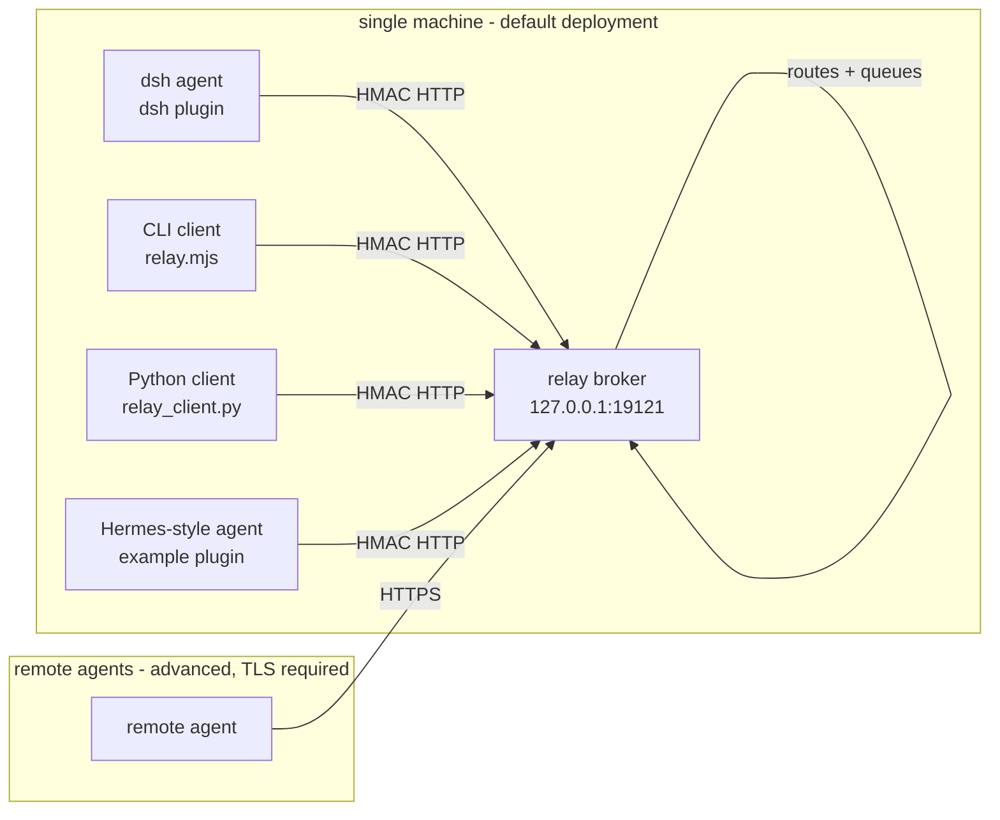

# dsh-agent-relay — Architecture

## What this is

A tiny, loopback-first **message relay** for multiple AI agents on one machine
(and, optionally, across machines). Agents do not talk to each other directly;
they talk to the broker, which authenticates, routes, queues and delivers
messages. This keeps the system simple: every agent needs only one HTTP client
and one shared secret.



## Components

| Component | Location | Role |
|---|---|---|
| Broker | `broker/` | Loopback HTTP service: v2/v3 HMAC auth, routing/ACL, SQLite queue with lease + token claims, server-held long-poll wake-up, on-demand worker spawn |
| dsh plugin | `lib/` (Cordis host/client halves) | Registers five `agent_relay_*` model tools; background heartbeat + lease polling, per-root sessions, receipts and sidebar status |
| CLI client | `adapters/cli/relay.mjs` | Zero-dependency Node client for scripts, cron jobs, Codex/Claude wrappers |
| Python client | `adapters/hermes/relay_client.py` | Pure-stdlib Python client for any Python-based agent |
| Setup | `setup/setup.js` | `init` (generate secret + config), `start`, `selfcheck` |

## Message flow

```mermaid
sequenceDiagram
    participant A as agent-alpha
    participant B as broker
    participant C as agent-beta

    A->>B: POST /v1/messages {origin, target, kind, body}
    B-->>A: 200 {message_id, root_id, protocol_version}
    C->>B: POST /v1/pull {agent, limit, lease_seconds}
    B-->>C: {messages: [<envelope>, lease_token]}
    C->>B: POST /v1/lease/renew (optional for long work)
    C->>B: POST /v1/ack {message_id, outcome, lease_token}
    B-->>A: query /v1/status; replies use parent_id/root_id
```

## Design decisions

1. **Lease polling, not push.** The v2/v3 broker keeps messages until TTL and
   agents poll with a bounded lease. Expired leases are re-queued; long work
   can renew its lease. There is no second delivery mechanism to keep in sync:
    the wake-up is the same claim, answered early.
2. **HMAC + timestamp anti-replay.** Shared secret signs
   `method + path + timestamp + body`. Timestamp skew > 300 s is rejected.
3. **Idempotency by message id.** Senders keep the same `id` across retries;
   the broker dedups; receivers dedup too. Exactly-once delivery is not
   guaranteed (at-least-once), but duplicate *processing* is prevented.
4. **Loopback first.** Default bind is 127.0.0.1. Remote mode exists but
   requires TLS — HMAC authenticates, it does not encrypt.
5. **No content logging.** The broker logs events (ids, errors), never message
   bodies. The dsh plugin keeps only an in-memory id-level history.
6. **Single protocol source.** `lib/protocol.js` owns v2/v3 canonical JSON,
   signature and envelope primitives; `broker/src/protocol.js` is only a
   re-export shim. This prevents the two implementations drifting.
7. **Zero dependencies.** Broker, CLI and Python client use only the standard
   library. The dsh plugin only needs the official `@deepseek-ai/dsh-tools`
   peer dependency.

## Compatibility

- Tested against **dsh 0.1.0-rc.6** (web profile plugin loading).
- Wire protocol **v2/v3 only** — see [PROTOCOL-V2.md](PROTOCOL-V2.md). The v1 generation
  was removed on 2026-09-19 (no v1 message existed in the queue since 2026-08-15
  and no live client registered). Requests without v2/v3 headers are refused 400.
