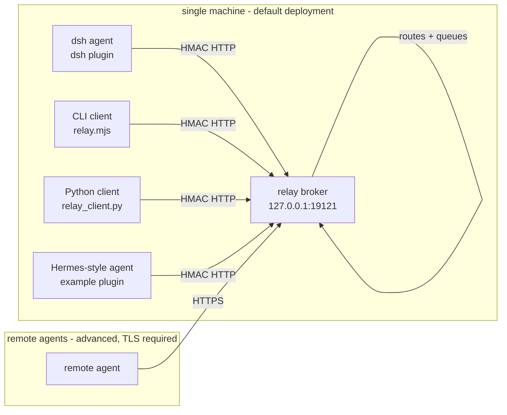
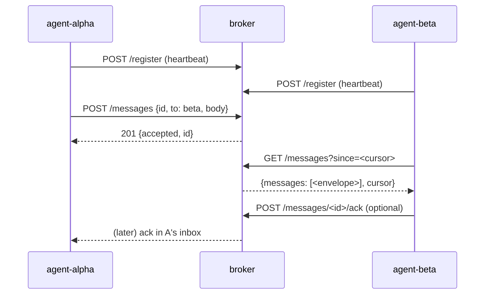

# dsh-agent-relay — Architecture

## What this is

A tiny, loopback-first **message relay** for multiple AI agents on one machine
(and, optionally, across machines). Agents do not talk to each other directly;
they talk to the broker, which authenticates, routes, queues and delivers
messages. This keeps the system simple: every agent needs only one HTTP client
and one shared secret.

## Components

| Component | Location | Role |
|---|---|---|
| Broker | `broker/` | HTTP service: HMAC auth, routing table, message queue (memory + optional JSONL), polling API, brute-force lockout, rate limiting |
| dsh plugin | repo root (cordis bundle) | Registers `relay_send` / `relay_recv` / `relay_peers` / `relay_history` model tools; background heartbeat + inbox polling |
| CLI client | `adapters/cli/relay.mjs` | Zero-dependency Node client for scripts, cron jobs, Codex/Claude wrappers |
| Python client | `adapters/hermes/relay_client.py` | Pure-stdlib Python client for any Python-based agent |
| Setup | `setup/setup.js` | `init` (generate secret + config), `start`, `selfcheck` |

## Message flow

## Design decisions

1. **Polling, not push.** The broker keeps messages for 7 days (TTL) and
   agents poll with an incremental cursor. No WebSocket, no server-push
   complexity, trivially restart-safe.
2. **HMAC + timestamp anti-replay.** Shared secret signs
   `method + path + timestamp + body`. Timestamp skew > 300 s is rejected.
3. **Idempotency by message id.** Senders keep the same `id` across retries;
   the broker dedups; receivers dedup too. Exactly-once delivery is not
   guaranteed (at-least-once), but duplicate *processing* is prevented.
4. **Loopback first.** Default bind is 127.0.0.1. Remote mode exists but
   requires TLS — HMAC authenticates, it does not encrypt.
5. **No content logging.** The broker logs events (ids, errors), never message
   bodies. The dsh plugin keeps only an in-memory id-level history.
6. **Zero dependencies.** Broker, CLI and Python client use only the standard
   library. The dsh plugin only needs the official `@deepseek-ai/dsh-tools`
   peer dependency.

## Compatibility

- Tested against **dsh 0.1.0-rc.6** (web profile plugin loading).
- Wire protocol **1.0** — see [PROTOCOL.md](PROTOCOL.md). Adapters refuse to
  run against an incompatible broker version.
