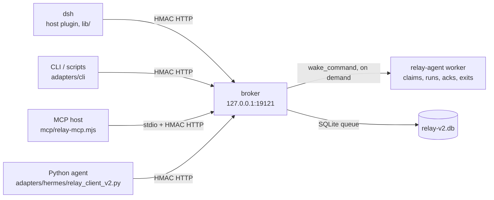

# dsh-agent-relay — Architecture

## What this is

A small **message relay** for the AI agents on one machine. Agents never talk to
each other directly; each talks to the broker over loopback, and the broker
authenticates, routes, queues, and delivers. An agent therefore needs one HTTP
client and one credential — and, unlike the earlier design, needs nothing running
while it is idle: the broker can start it when something arrives.

## Components

| Component | Location | Role |
|---|---|---|
| Broker | `broker/` | Loopback HTTP service: v2/v3 HMAC auth + keyring, per-mode routing ACL, SQLite queue with lease + token claims, server-held long-poll, on-demand worker spawn, failure notices |
| Protocol | `lib/protocol.js` | The single source for the envelope, canonical JSON, both signature schemes and the limits; `broker/src/protocol.js` is a re-export so there is one definition to change |
| Config | `lib/relay-config.mjs` | One layering rule (deployment config → personal file → env → flags) shared by the CLI, the MCP server and the worker |
| Credentials | `lib/credentials.mjs` | Resolution order and a *redacted* description of where a secret came from |
| dsh plugin | `lib/index.js` (+ the Cordis host/client halves) | `agent_relay_*` model tools, per-root sessions, receipts, sidebar status |
| MCP server | `mcp/relay-mcp.mjs` | stdio front door for hosts that start an agent per session: `relay_ask`, `relay_send`, `relay_inbox`, `relay_reply`, `relay_status`, `relay_agents` |
| Worker | `adapters/relay-agent.mjs` | Short-lived claim-process-ack loop, spawned by the broker; exits when the inbox drains |
| CLI | `adapters/cli/relay.mjs` | `v2 …` for scripts, cron and wrappers; exit 3 means "peer unreachable" |
| Python client | `adapters/hermes/relay_client_v2.py` | Pure-stdlib client for Python-based agents |
| Ops tools | `setup/` | `setup.js` (init/start/selfcheck), `add-member.mjs`, `sync-secrets.mjs`, `doctor.mjs`, `enable-wake.mjs`, `migrate-v2.mjs`, `capture-adapter.mjs` |

## Lifecycle

`POST /v1/messages` durably queues a request and answers with presence
(`target_online`, `last_seen_at`), whether a worker was started (`will_wake`), and
a `hint` when neither is true. A recipient claims with `POST /v1/pull` — optionally
held open with `wait_seconds`, optionally narrowed to one conversation with
`match_root_id` — and receives a `lease_token` per message. It settles with
`POST /v1/ack` (`completed`, or `retry`, which re-queues until `maxAttempts` makes
it `failed`) and may extend a lease on long work with `POST /v1/lease/renew`.
A request that fails or expires produces an "undelivered" reply to its origin,
emitted by the broker's own 60 s sweep rather than waiting for someone to poll.
The route and field-level contract is [PROTOCOL-V2.md](PROTOCOL-V2.md); this file
owns only the shape of the system.

## Design decisions

1. **Loopback only, by decision.** Cross-machine membership was dropped: the
   transport authenticates but does not encrypt, so a networked broker would need
   a TLS front end, per-agent secrets, and an exposure review for no gain a local
   bus does not need. Everything else in this list follows from that.
2. **Presence is measured, not declared.** "Online" means the agent claimed
   within the last 90 s (`store.lastPullAt`). The v1 heartbeat endpoint was
   removed once the audit showed no client had ever called it — a registration
   nobody used is how the broker came to believe deaf members were listening.
3. **One wake path, not two.** Delivery is always a claim. Long-poll answers a
   held pull the moment a message lands; `wake_command` starts a worker when no
   pull is held and no recent claim exists. Because a woken worker claims like
   any other client, it cannot serve the same message twice.
4. **At-least-once with a single delivery credential.** A claim issues a fresh
   `lease_token`; acks and renewals must present it while the lease is live. The
   sender keeps an idempotency key and the broker dedups on
   `(origin, idempotency_key)`, so retries do not duplicate work.
5. **SQLite is the only copy of queue state.** Since 0.7.0 the in-memory mirror
   is gone: claims are atomic `UPDATE … RETURNING`, housekeeping is set-based, and
   the read paths query the same rows an operator would. `persist: false` selects
   `:memory:` rather than a second code path, so tests run production SQL.
6. **One generation.** v1 was deleted rather than deprecated — two maintained
   generations of store, auth, client and CLI served nobody. Retired v1 config
   keys are ignored on load instead of breaking an existing deployment.
7. **HMAC + timestamp anti-replay.** The signed string is
   `agent\n[keyId\n]ts\nMETHOD\npath\nsha256hex(body)`; skew beyond 300 s is
   rejected, comparison is constant-time. There is deliberately no rate limiter
   or auth-failure lockout — see [SECURITY.md](SECURITY.md).
8. **No content logging.** The broker logs ids and outcomes, never bodies; the one
   exception is a bounded worker-stderr tail on a failed wake, so a delivery that
   died is diagnosable (see [SECURITY.md](SECURITY.md)).

## Assessed and not done

Recorded so these do not come back as new ideas every review.

- **Replacing HTTP with a Windows named pipe.** Rejected on evidence, not taste.
  The gain would be "no TCP port"; the identity argument does not hold, because
  Node exposes no peer-credential API (`net.Socket.prototype` offers only
  `_getpeername`, no client PID, no SDDL access), so the broker still could not
  tell *which* process connected and HMAC signing would remain mandatory.
  Meanwhile both stdlib clients (the Python client, the deployed Hermes adapter)
  speak HTTP, so a second transport would recreate exactly the dual-generation
  problem that removing v1 just deleted. The measured latency that motivated the
  idea is no longer in the transport: a broker-held wake round trip is ~250 ms
  end to end and a store pull is sub-millisecond. The path that does matter —
  a held pull being answered when a message lands — measures 10–30 ms.
- **Dropping the v2 signature scheme.** Deferred, not skipped. The in-repo dsh
  plugin still signs without a key id, while the deployed Hermes adapter and the
  Feishu bot already sign v3 with the implicit `legacy` key. Both schemes share
  one secret lookup and one verifier, so the carrying cost is a branch — whereas
  deleting v2 would break the *installed* plugin until every host updates it.
  Revisit when the plugin can declare a minimum broker version, or the next time
  a key is actually rotated (rotation is the only thing v3 buys over v2).

## Compatibility

- Tested against **dsh 0.1.0-rc.6** (web profile plugin loading).
- Wire protocol **v2/v3 only** — see [PROTOCOL-V2.md](PROTOCOL-V2.md). The v1
  generation was removed in 0.7.0 after the 2026-09-19 audit showed no v1 message
  in the queue since 2026-08-15 and no live client registering; requests without
  v2/v3 headers are refused with `400`.
- Both signature schemes stay: the dsh plugin signs the v2 scheme, while
  key-id-bearing clients (the deployed Hermes adapter, the Feishu bot) use the v3
  keyring. They share one secret lookup — the implicit `legacy` key — so this is
  one verifier with an optional header, not two protocol stacks.
